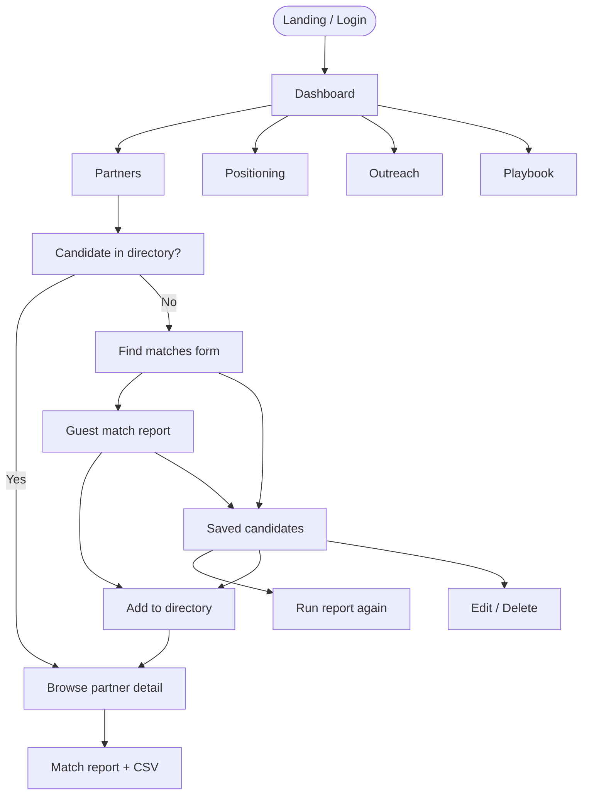
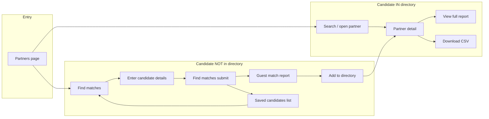
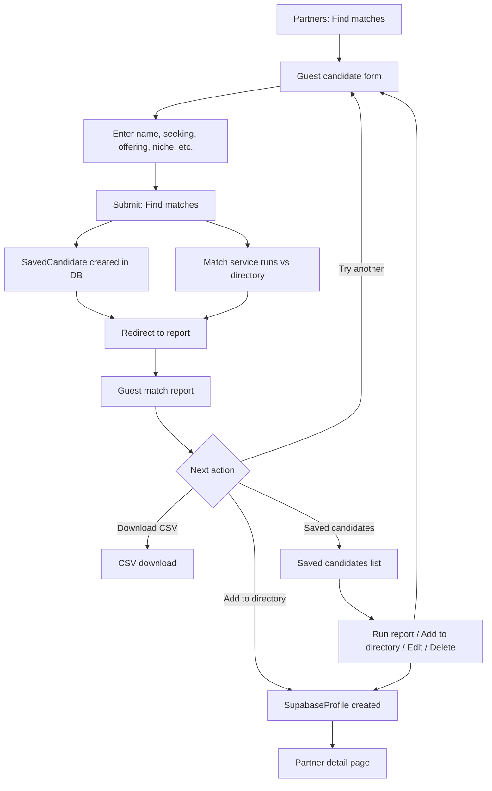
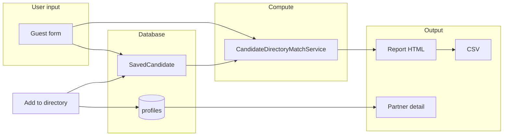

          # JV Matchmaker – Client Flow

Visual map of how users move through the app. Render the Mermaid diagrams in GitHub, [Mermaid Live](https://mermaid.live), or any Mermaid-supported viewer.

---

## High-level flow

---

## Partner discovery & match report (detailed)

---

## Guest candidate flow (find matches → report → save / add)

---

## Key screens and URLs

| Screen | URL | Purpose |
|--------|-----|---------|
| Partners | `/matching/partners/` | Browse directory, “Find matches”, “Saved candidates” |
| Partner detail | `/matching/partners/<uuid>/` | One partner; “View full report”, “Download CSV” |
| In-directory report | `/matching/partners/<uuid>/matches-report/` | Pre-computed matches for that partner |
| Find matches (form) | `/matching/find-matches/` | Enter guest candidate; submit saves to DB + runs match |
| Guest report | `/matching/find-matches/report/` | On-the-fly match report; “Add to directory”, CSV |
| Saved candidates | `/matching/saved-candidates/` | List of saved candidates |
| Saved detail | `/matching/saved-candidates/<id>/` | Run report, Add to directory, Edit, Delete |

---

## Data flow

- **Guest form** → always creates/updates **SavedCandidate** and runs **CandidateDirectoryMatchService**.
- **Report** comes from session (guest) or from DB (in-directory).
- **Add to directory** creates a **SupabaseProfile** and links it from **SavedCandidate** (`added_to_directory`).
