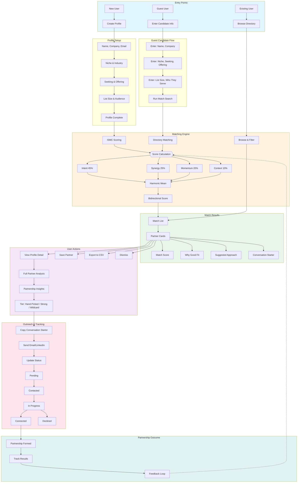
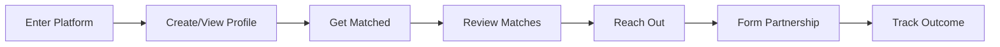
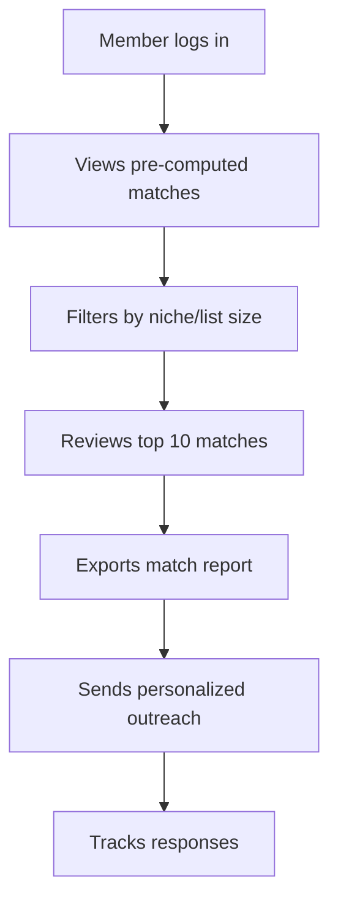
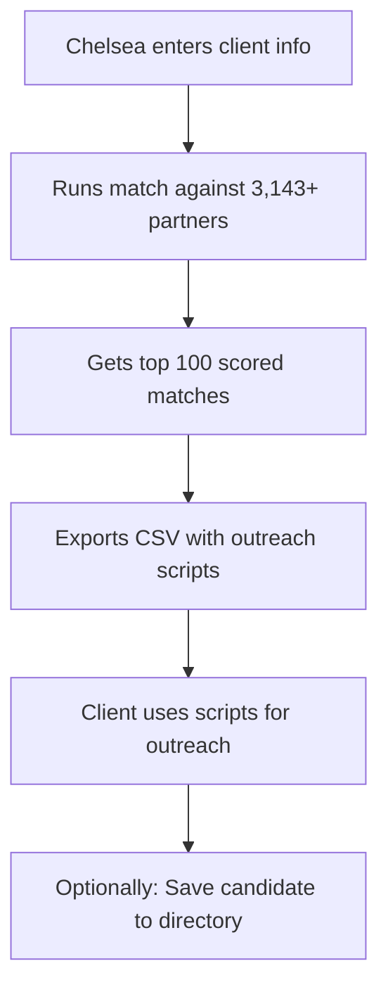
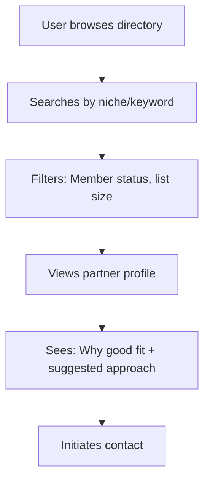
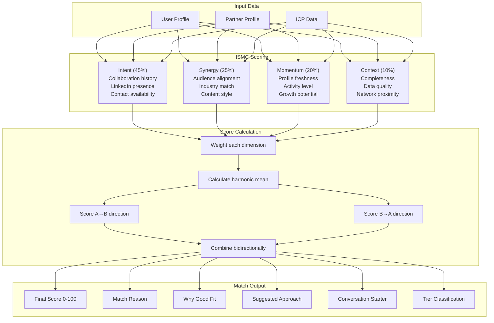
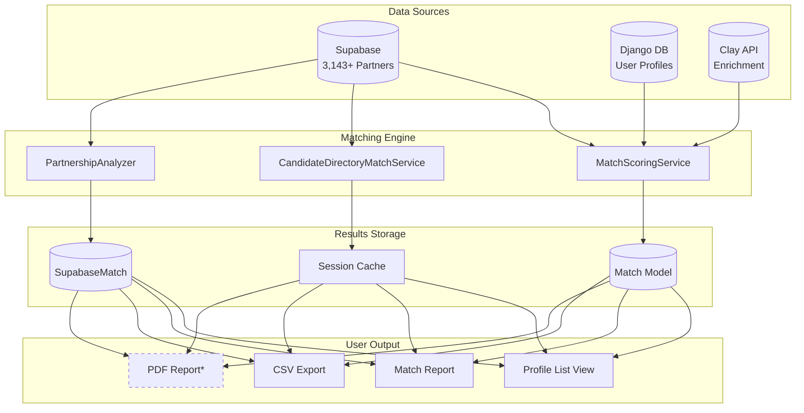
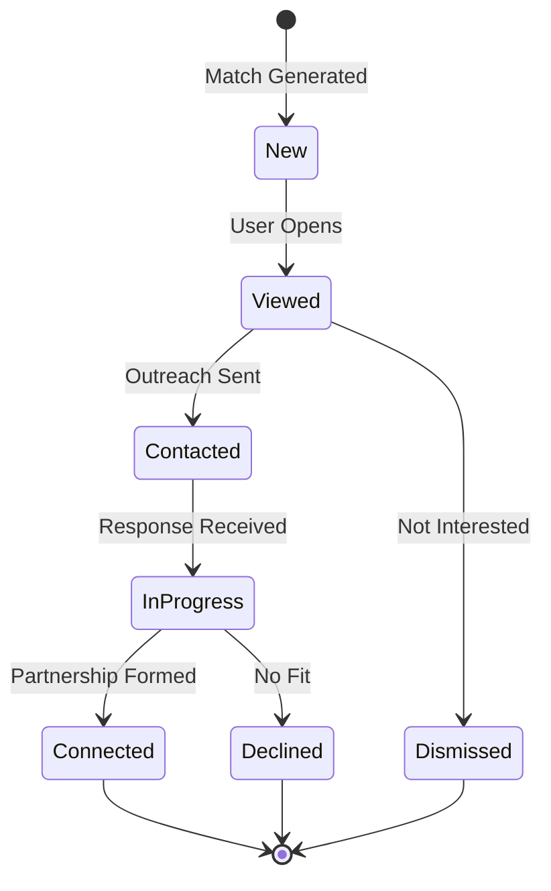
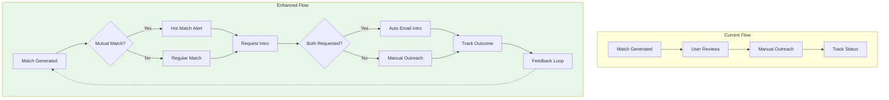

# JV Matchmaker Platform: Client Flow

## Overview Diagram

---

## Simplified Linear Flow

---

## User Journey by Persona

### Persona 1: JV Directory Member

### Persona 2: Chelsea's Client (Guest Matching)

### Persona 3: Partner Discovery

---

## Matching Algorithm Flow

---

## Data Flow Architecture

*PDF Report = planned feature from competitive enhancements

---

## Status Tracking Flow

---

## Future State: With Competitive Enhancements

---

## Quick Reference: URL Structure

| URL | Purpose |
|-----|---------|
| `/partners/` | Browse 3,143+ directory |
| `/partners/<id>/` | View partner detail |
| `/partners/<id>/matches-report/` | Show matches for partner |
| `/find-matches/` | Guest candidate form |
| `/find-matches/report/` | Guest matching results |
| `/saved-candidates/` | Manage saved candidates |
| `/profiles/` | User's own profiles |
| `/matches/` | User's calculated matches |
